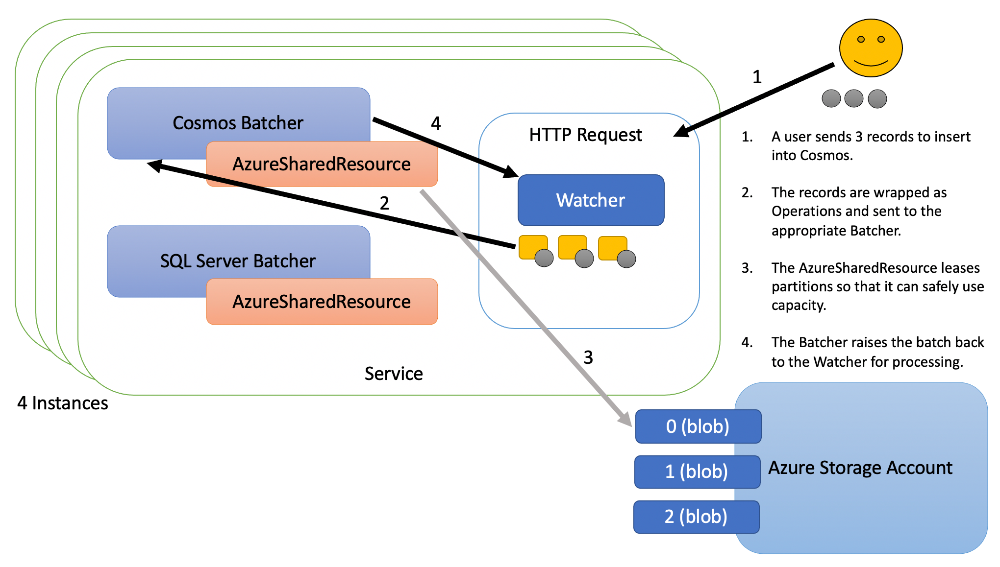
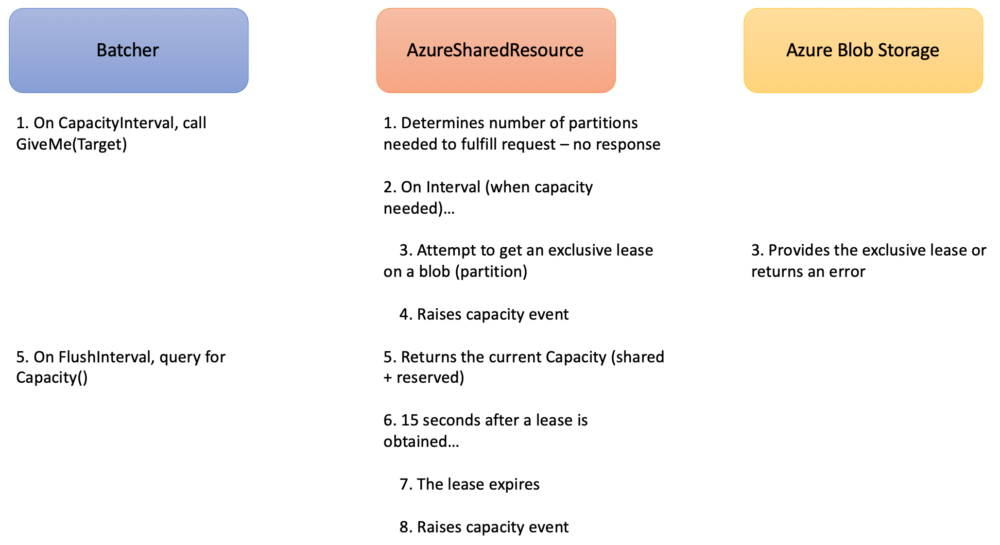

# Batcher

In the most simple case, Batcher allows you to enqueue operations which are then given back to you in a batch. However, in a more common case, datastores have performance limits and work executed against those datastores have costs in terms of memory, CPU, disk, network, and so on (whether you have quantified those costs or not). In this case, Batcher can provide an easy way for developers to consume all available resources on the datastore without exceeding the limits.

Consider this example...

You have an Azure Cosmos database that you have provisioned with 20k RU. Your service is in a Pod with 4 replicas on Kubernetes that need to share the capacity. Your service gets large jobs for processing, commonly 100k records or more at a time. Each record costs 10 RU. If we imagine that 2 jobs come in at the same time (1 job to each of 2 replicas), then we have 100k x 2 x 10 RU or 2m RU of work that needs to be done. Given that we have 20k capacity per second, we know that we could complete the work in 100 seconds if we could spread it out. Without something like Batcher, each process might try and send their own 100k messages in parallel and with no knowledge of the other. This would cause Cosmos to start issuing 429 TooManyRequests error messages and given the volume might even cut you off with 503 Service Unavailable error messages. Batcher solves this problem by allowing you to share the capacity across multiple replicas and controlling the flow of traffic so you don't exceed the 20k RU per second.

## Terminology

There are several components related to Batcher...

- __Batcher__: You will create one Batcher for each datastore that has capacity you wish to respect. Lots of Watcher will share the same Batcher. Batchers are long-lived.

- __Operation__: You will enqueue Operations into Batcher. An Operation has an associated "Watcher", a "cost", a designation of whether or not it can be batched, a counter for the number of times it has been "attempted", and a "payload" (which can be anything you want).

- __Watcher__: You will create one Watcher per process that you wish to manage. The Watcher receives the batches as they become available. Watchers are short-lived. For instance, if your solution is an HTTP server, you will probably create a Watcher with each request, send your Operations to a shared Batcher, and then get batches for processing back on your Watcher. If you need to handle different types of Operations that are processed in different ways or if they have different characteristics (such as an optimal batchsize), you might create a separate Watcher for each of those use-cases.

There are also 2 rate limiters provided out-of-the-box...

- __ProvisionedResource__: This is a simple rate limiter that has a fixed capacity per second.

- __AzureSharedResource__: This rate limiter allows you to reserve a fixed amount of capacity and then share a fixed amount of capacity across multiple processes.

Some other terms will be used throughout...

- __Instance__: Using AzureSharedResource, you can share the capacity of a datastore across different processes, containers, servers, Pod replicas, etc. Hereafter, these separate entities will be refered to as Instances.

- __Target__: As Operations are enqueued or marked done in Batcher it updates a Target number which is the total cost Batcher thinks is necessary to process any outstanding Operations. In other words, as Operations are enqueued, the Target grows by the cost of that Operation. When a batch is marked done, the Target is reduced by the cost of all Operations in that batch.

- __Capacity__: The capacity that the rate limiter has been able to procure is available via the Capacity() method or the capacity event.

- __MaxCapacity__: When using a rate limiter the MaxCapacity is the maximum capacity that could even be provided. For AzureSharedResource, this is the total of SharedCapacity and ReservedCapacity. For ProvisionedResource, this is the MaxCapacity that was provided when New() was called.

  - __SharedCapacity__: AzureSharedResource has a SharedCapacity which is defined when NewAzureSharedResource() is called. This is the capacity for the datastore that is shared across any number of Instances. In the most simple case, if a Cosmos database had 20K RU and 4 Instances of the service using it, you might specify the SharedCapacity as 20K on each Instance if you want all the capacity shared. SharedCapacity reduces cost.

  - __ReservedCapacity__: AzureSharedResource optionally allows you to specify a ReservedCapacity that will only be used by this Instance. For example, in the above example, if you wanted to reserve 2K RU for each of your Instances, you might use a ReservedCapacity of 2K (on each of 4 Instances) and then use 12K for the SharedCapacity. ReservedCapacity reduces latency.

- __Partitions__: The AzureSharedResource rate limiter divides the SharedCapacity by a factor to determine the number of partitions to provision as blobs. If a process owns the exclusive lease on the partition blob, then it is allowed to use 1 factor of capacity. For example, if the SharedCapacity is 10K and the factor is 1K, then there are 10 partitions, control of each is worth 1K capacity.

- __Inflight__: The number of batches that are currently being processed (i.e. the batch has been raised to the callback function on the Watcher, but has not not completed that function yet).



## Features

- __Datastore Agnostic__: Batcher does not process the Operations it batches, it just notifies the caller when a batch is ready for processing. This design means the solution can work with any datastore.

- __Batching__: You may specify that Operations can be batched (ex. writes) and then specify constraints, like how often Operations should be flushed, maximum batch size, datastore capacity, etc. Batcher will send you batches of Operations ready for you to process within all your constraints.

- __Rate Limiting__: You may optionally attach a rate limiter to Batcher that can restrict the Operations so they don't exceed a certain cost per second.

- __Shared Capacity__: Batcher supports using a rate limiter. One of the included rate limiters is AzureSharedResource which allows for sharing capacity across multiple Instances. Sharing capacity in this way can reduce cost.

- __Reserved Capacity__: AzureSharedResource also supports a reserved capacity to improve latency. For instance, you might have 4 Instances that need to share 20K RU in a Cosmos database. You might give each 2K reserved capacity and share the remaining 14K RU. This gives each process low latency up to 2K RU but allows each process to request more.

- __Cost per Operation__: Each Operation that you enqueue to Batcher will have an associated cost.

- __Limit Retries__: Commonly datastores have transient faults. You want to retry those Operations after a short time because they might succeed, but you don't want to retry them forever. Watchers can be set to enforce a maximum number of retries.

- __Pause__: When your datastore is getting too much pressure (throwing timeouts or too-many-requests), you can pause the Batcher for a short period of time to give it some time to catch-up.

## Simple Explanation

1. A Batcher is created for a datastore. It may be assigned a rate limiter.

1. A user creates a Watcher, then enqueues Operations into the Batcher.

1. In the Batcher processing loop, the CapacityInterval asks for capacity from the rate limiter to process the Operations.

1. In the Batcher processing loop, the FlushInterval organizes Operations into batches and raises them back to the Watchers.

1. The user performs the queries as batches are raised.

## Usage

This code sample shows the general usage...

1. If you are going to use rate limiting...

    1. Create one or more rate limiters via New() methods

    1. Provision() those rate limiters

    1. Start() those rate limters

1. Create one or more Batchers via New() methods

1. Start() those Batchers

1. As you need to process data...

    1. Create a Watcher

    1. Enqueue Operations into the appropriate Batcher

```go
import (
    gobatcher "github.com/plasne/go-batcher"
)

func main() {

    // start getting shared resource capacity
    azresource := gobatcher.NewAzureSharedResource(AZBLOB_ACCOUNT, AZBLOB_CONTAINER, uint32(CAPACITY)).
        WithMasterKey(AZBLOB_KEY).
        WithFactor(1000)
    resourceListener := azresource.AddListener(func(event string, val int, msg string, metadata interface{}) {
        switch event {
        case gobatcher.ErrorsEvent:
            log.Err(errors.New(msg)).Msgf("AzureSharedResource raised the following error...")
        }
    })
    defer azresource.RemoveListener(resourceListener)
    if err := azresource.Provision(ctx); err != nil {
        panic(err)
    }
    if err := azresource.Start(ctx); err != nil {
        panic(err)
    }

    // start the batcher
    batcher := gobatcher.NewBatcher().
        WithRateLimiter(azresource)
    batcherListener := batcher.AddListener(func(event string, val int, msg string, metadata interface{}) {
        switch event {
        case gobatcher.PauseEvent:
            log.Debug().Msgf("batcher paused for %v ms to alleviate pressure on the datastore.", val)
        case gobatcher.AuditFailEvent:
            log.Debug().Msgf("batcher audit-fail: %v", msg)
        }
    })
    defer batcher.RemoveListener(batcherListener)
    if err := batcher.Start(); err != nil {
        panic(err)
    }

    // example of an HTTP call
    http.HandleFunc("/ingest", func(res http.ResponseWriter, req *http.Request) {

        // create a batch watcher
        watcher := gobatcher.NewWatcher(func(batch []gobatcher.IOperation) {
            // process the batch
        }).WithMaxAttempts(3)

        // enqueue operations
        for i := 0; i < total; i++ {
            payload := struct{}{}
            op := gobatcher.NewOperation(watcher, 10, payload).AllowBatch()
            if errorOnEnqueue := batcher.Enqueue(op); errorOnEnqueue != nil {
                panic(errorOnEnqueue)
            }
        }

    })

}
```

:information_source: There is a full sample in the [sample](/sample) folder.

There are some additional commands that can be executed on Batcher, including...

- __Pause()__: This allows you to pause the main processing loop for Batcher. For instance, no batches will be flushed, no audits will be performed, etc.

- __Flush()__: You may call Flush() to queue a manual flush. It will be processed immediately, but the Flush() method is not blocking.

## Batcher Configuration

Creating a new Batcher with all defaults looks like this...

```go
batcher := NewBatcher()
```

Creating with all available configuration items might look like this...

```go
batcher := gobatcher.NewBatcherWithBuffer(buffer).
    WithRateLimiter(rateLimiter).
    WithFlushInterval(100 * time.Millisecond).
    WithCapacityInterval(100 * time.Millisecond).
    WithAuditInterval(10 * time.Second).
    WithMaxOperationTime(1 * time.Minute).
    WithPauseTime(500 * time.Millisecond).
    WithErrorOnFullBuffer().
    WithEmitBatch().
    WithMaxConcurrentBatches(10)
```

- __Buffer__ [DEFAULT: 10,0000]: The buffer determines how many Operations can be enqueued at a time. When ErrorOnFullBuffer is "false" (the default), the Enqueue() method blocks until a slot is available. When ErrorOnFullBuffer is "true" an error of type `BufferFullError{}` is returned from Enqueue().

- __RateLimiter__ [OPTIONAL]: If provided, it will be used to ensure that the cost of Operations does not exceed the capacity available per second.

- __FlushInterval__ [DEFAULT: 100ms]: This determines how often Operations in the buffer are examined. Each time the interval fires, Operations will be dequeued and added to batches or released individually (if not batchable) until such time as the aggregate cost of everything considered in the interval exceeds the capacity allotted this timeslice. For the 100ms default, there will be 10 intervals per second, so the capacity allocated is 1/10th the available capacity. Generally you want FlushInterval to be under 1 second though it could technically go higher.

- __CapacityInterval__ [DEFAULT: 100ms]: This determines how often the Batcher asks the RateLimiter for capacity. Generally you should leave this alone, but you could increase it to slow down the number of storage Operations required for sharing capacity. Please be aware that this only applies to Batcher asking for capacity, it doesn't mean the rate limiter will allocate capacity any faster, just that it is being asked more often.

- __AuditInterval__ [DEFAULT: 10s]: This determines how often the Target and Inflight variables are audited to ensure they are accurate. The Target is manipulated with atomic Operations and abandoned batches are cleaned up after MaxOperationTime so Target should always be accurate. Therefore, we should expect to only see "audit-pass" and "audit-skip" events. This audit interval is a failsafe that if the buffer is empty and the MaxOperationTime (on Batcher only; Watchers are ignored) is exceeded and the Target is greater than zero, it is reset and an "audit-fail" event is raised. Since Batcher is a long-lived process, this audit helps ensure a broken process does not monopolize SharedCapacity when it isn't needed.

- __MaxOperationTime__ [DEFAULT: 1m]: This determines how long the system should wait for the Watcher's callback function to be completed before it assumes it is done and decreases the Target anyway. It is critical that the Target reflect the current cost of outstanding Operations. The MaxOperationTime ensures that a batch isn't orphaned and continues reserving capacity long after it is no longer needed. Please note there is also a MaxOperationTime on the Watcher which takes precident over this time.

- __PauseTime__ [DEFAULT: 500ms]: This determines how long the FlushInterval, CapacityInterval, and AuditIntervals are paused when Batcher.Pause() is called. Typically you would pause because the datastore cannot keep up with the volume of requests (if it happens maybe adjust your rate limiter).

- __ErrorOnFullBuffer__ [OPTIONAL]: Normally the Enqueue() method will block if the buffer is full, however, you can set this configuration flag if you want it to return an error instead.

- __WithEmitBatch__ [OPTIONAL]: DO NOT USE IN PRODUCTION. For unit testing it may be useful to batches that are raised across all Watchers. Setting this flag causes a "batch" event to be emitted with the operations in a batch set as the metadata (see the sample). You would not want this in production because it will diminish performance but it will also allow anyone with access to the batcher to see operations raised whether they have access to the Watcher or not.

- __WithMaxConcurrentBatches__ [OPTIONAL]: If you specify this option, Batcher will ensure that the number of batches being processed at one time does not exceed this value. Batches are still only produced on the FlushInterval. When a batch is marked done, the concurrency slot is freed for another batch.

After creation, you must call Start() on a Batcher to begin processing. You can enqueue Operations before starting if desired (though keep in mind that there is a Buffer size and you will fill it if the Batcher is not running). When you are done using a Batcher, you can Stop() it.

Creating a new Operation with all defaults might look like this...

```go
operation := gobatcher.NewOperation(&watcher, cost, payload)
```

Creating with all available configuration options might look like this...

```go
operation := gobatcher.NewOperation(&watcher, cost, payload).AllowBatch()
```

...or...

```go
operation := gobatcher.NewOperation(&watcher, cost, payload).WithBatching(true)
```

- __Watcher__ [REQUIRED]: To create a new Operation, you must pass a reference to a Watcher. When this Operation is put into a batch, it is to this Watcher that it will be raised.

- __Cost__ [REQUIRED]: When you create a new Operation, you must provide a cost of type `uint32`. You can supply "0" but this Operation will only be effectively rate limited if it has a non-zero cost.

- __Payload__ [REQUIRED]: When you create a new Operation, you will provide a payload of type `interface{}`. This could be the entity you intend to write to the datastore, it could be a query that you intend to run, it could be a wrapper object containing a payload and metadata, or anything else that might be helpful so that you know what to process.

- __AllowBatch__ [OPTIONAL]: If specified, the Operation is eligible to be batched with other Operations. Otherwise, it will be raised as a batch of a single Operation.

- __WithBatching__ [DEFAULT: false]: WithBatching=true is the same as AllowBatch(). This alternate expression is useful if there is an existing test for whether or not an Operation can be batched.

Creating a new Watcher with all defaults might look like this...

```go
watcher := gobatcher.NewWatcher(func(batch []gobatcher.IOperation) {
    // your processing function goes here
})
```

Creating with all available configuration options might look like this...

```go
watcher := gobatcher.NewWatcher(func(batch []gobatcher.IOperation) {
    // your processing function goes here
}).
    WithMaxAttempts(3).
    WithMaxBatchSize(500).
    WithMaxOperationTime(1 * time.Minute)
```

- __processing_func__ [REQUIRED]: To create a new Watcher, you must provide a callback function that accepts a batch of Operations. The provided function will be called as each batch is available for processing. When the callback function is completed, it will reduce the Target by the cost of all Operations in the batch. If for some reason the processing is "stuck" in this function, they Target will be reduced after MaxOperationTime. Every time this function is called with a batch it is run as a new goroutine so anything inside could cause race conditions with the rest of your code - use atomic, sync, etc. as appropriate.

- __MaxAttempts__ [OPTIONAL]: If there are transient errors, you can enqueue the same Operation again. If you do not provide MaxAttempts, it will allow you to enqueue as many times as you like. Instead, if you specify MaxAttempts, the Enqueue() method will return `TooManyAttemptsError{}` if you attempt to enqueue it too many times. You could check this yourself instead of just enqueuing, but this provides a simple pattern of always attempt to enqueue then handle errors.

- __MaxOperationTime__ [OPTIONAL]: This determines how long the system should wait for the callback function to be completed on the batch before it assumes it is done and decreases the Target anyway. It is critical that the Target reflect the current cost of outstanding Operations. The MaxOperationTime ensures that a batch isn't orphaned and continues reserving capacity long after it is no longer needed. If MaxOperationTime is not provided on the Watcher, the Batcher MaxOperationTime is used.

Creating a new ProvisionedResource might look like this...

```go
resource := NewProvisionedResource(maxCapacity)
```

- __MaxCapacity__ [REQUIRED]: To create a provisioned resource, you must provide the capacity. Since the ProvisionedResource is a fixed capacity rate limiter, this value serves as both MaxCapacity and Capacity.

Creating a new AzureSharedResource might look like this...

```go
resource := gobatcher.NewAzureSharedResource("acountName", "containerName", sharedCapacity).
    WithMasterKey("masterKey")
```

- __SharedCapacity__ [REQUIRED]: To create a provisioned resource, you must provide the capacity that will be shared across all processes. Based on this and Factor, the correct number of partitions can be created in the Azure Storage Account.

- __AccountName__ [REQUIRED]: The account name of the Azure Storage Account that will host the zero-byte blobs that serve as partitions for capacity.

- __ContainerName__ [REQUIRED]: The container name that will host the zero-byte blobs that serve as partitions for capacity.

- __MasterKey__ [REQUIRED]: There needs to be some way to authenticate access to the Azure Storage Account, right now only master keys are supported. When other methods are supported, this will become optional, but you will always require one of the available methods.

- __WithFactor__ [DEFAULT: 1]: The SharedCapacity will be divided by the Factor (rounded up) to determine the number of partitions to create when Provision() is called. For example, if you have 10,200 of SharedCapacity and a Factor of 1000, then there will be 11 partitions. Whenever a partition is obtained by AzureSharedResource, it will be worth a single Factor or 1000 RU. For predictability, the SharedCapacity should always be evenly divisible by Factor. AzureSharedResource does not support more than 500 partitions.

- __WithReservedCapacity__ [OPTIONAL]: You could run AzureSharedResource with only SharedCapacity, but then every time it needs to run a single operation, the latency of that operation would be increased by the time it takes to allocate a partition. To improve the latency of these one-off operations, you may reserve some capacity so it is always available. Generally, you would reserve a small capacity and share the bulk of the capacity.

- __WithMaxInterval__ [DEFAULT: 500ms]: This determines the maximum time that the AzureSharedResource will wait before attempting to allocate a new partition (if one is needed). The interval is random to improve entropy, but it won't be longer than this specified time. If you want fewer storage transactions, you could increase this time, but it would slow down how quickly the AzureSharedResource can obtain new RUs.

- __WithMocks__ [OPTIONAL]: For unit testing, you can pass mocks to AzureSharedResource to emulate an Azure Storage Account. See the included unit tests for examples.

After creation, you must call Provision() and then Start() on any rate limiters to begin processing. When you are done using a rate limiter, you can Stop() it.

## Events

Events are raised with a "name" (string), "val" (int), and "msg" (*string).

The following events can be raised by Batcher...

- __shutdown__: This is raised after Stop() is called on a Batcher instance.

- __pause__: This is raised after Pause() is called on a Batcher instance. The val is the number of milliseconds that it was paused for.

- __audit-fail__: This is raised if an error was found during the AuditInterval. The msg contains more details. Should an audit fail, there is no additional action required, the Target will automatically be remediated.

- __audit-pass__: This is raised if the AuditInterval found no issues.

- __audit-skip__: If the Buffer is not empty or if MaxOperationTime (on Batcher) has not been exceeded by the last batch raised, the audit will be skipped. It is normal behavior to see lots of skipped audits.

The following events can be raised by ProvisionedResource and AzureSharedResource...

- __shutdown__: This is raised after Stop() is called on a rate limiter instance.

- __capacity__: This is raised anytime the Capacity changes. The val is the available capacity.

- __batch__: This is raised only when WithEmitBatch has been added to Batcher and whenever a batch is raised to any Watcher. The val is the count of the operations in the batch.

In addition, the following events can be raised by AzureSharedResource...

- __failed__: This is raised if the rate limiter fails to procure capacity. This does not indicate an error condition, it is expected that attempts to procure additional capacity will have failures. The val is the index of the partition that was not obtained.

- __released__: This is raised whenever the rate limiter releases capacity. The val is the index of the partition for which the lease was released.

- __allocated__: This is raised whenever the rate limiter gains capacity. The val is the index of the partition for which an exclusive lease was obtained.

- __error__: This is raised if there was some unexpected error condition, such as an authentication failure when attempting to allocate a partition.

- __created-container__: The Azure Storage Account must exist, but the container can be created in Provision(). This event is raised if that happens. The msg is the fully qualified path to the container.

- __verified_container__: During Provision(), if the container already exists, this event is raised. The msg is the fully qualified path to the container.

- __created-blob__: During Provision(), if a zero-byte blob needs to be created for a partition, this event is raised. The val is the index of the partition created.

- __verified_blob__: During Provision(), if a zero-byte blob partition was found to exist, this event is raised. The val is the index of the partition verified.

## Rate Limiting

The AzureSharedResource rate limiter works like this...



The ProvisionedResource plugs into Batcher the same way, but its capacity never changes and it has no dependency on Azure Blob Storage.

### Rate Limiting Scenarios

There are a couple of scenarios I want to call attention to...

- ReservedCapacity plus SharedCapacity: Using 100% ReservedCapacity reduces latency and using 100% SharedCapacity is very cost efficient, however, it is generally best to find a happy middle-ground - a small amount of ReservedCapacity and the rest as SharedCapacity.

- Operations per Second: If you want to limit the number of Operations per second rather than on the cost of those operations. You can create all Operations with a cost of 1 and set the capacity appropriately.

### Cost Savings

Traditionally if you want to run multiple instances of a service, you might provision capacity in your datastore times the number of instances. For example, in Azure Cosmos, if you need 20K RU and have 4 instances, you might provision 80K RU to ensure that any node could operate at maximum capacity.

Using AzureSharedResource, you might still reserve capacity per instance, but it can be a small amount. You can then share capacity across the instances. For instance, in the same scenario, you might reserve 2K RU for the 4 instances and (minimally) share an addition 18K RU ().

To give a cost comparison with retail pricing in the East US region with 1 TB of capacity:

- 80K RU is $4,992 per month

- 26K RU is $1,768 per month

### Cost Increase

Using default settings, each instance of AzureSharedResource will make a single storage transaction roughly every 250 milliseconds _when it needs additional capacity_. Therefore, we can determine the maximum cost for 4 instances on an Azure Storage Account GPv2 (or Blob) as...

`(4 processes) x (4 lease operations per second) x (60 seconds per minute) x (60 minutes per hour) x 730 (hours per month) / (10,000 operations per billing unit) * ($0.004 per billing unit) = ~$168 month`

However, this is a maximum cost - actual costs in many cases will be much lower as there are only storage operations when additional capacity is needed.

## Determining Cost

A Batcher with a rate limiter depends on each operation having a cost. The following documents provide you with assistance on determining what values you should use for cost.

- [Determine costs for operations in Cosmos](./cost-in-cosmos.md)

- [Determine costs for operations in a datastore that is not rate limited](./cost-in-non-rate-limited.md)

## Areas for improvement

- This tool was originally designed to limit transactions against Azure Cosmos which has a cost model expressed as a single composite value (Request Unit). For datastores that might have more granular capacities, it would be nice to be able to provision Batcher with all those capacities and have an enqueue method that supported those costs. For example, memory, CPU, disk, network, etc. might all have separate capacities and individual queries might have individual costs.

- There is currently no way to change capacity in the rate limiters once they are provisioned, but there is no identified use-case yet for this feature.

- There is currently no good way to model a datastore that autoscales but might require some time to increase capacity. Ideally something that allowed for capacity to increase by "no more than x amount over y time" would helpful. This could be a rate limiter or a feature that is added to existing rate limiters.

- The pause logic is a simple fixed amount of time to delay new batches, but it might be nice to have an exponential back-off.
