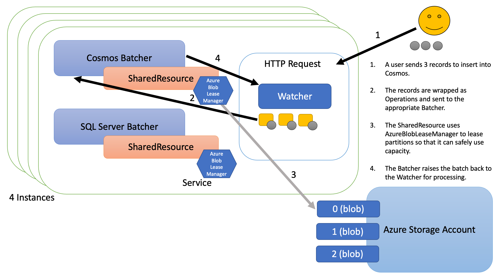

# Batcher

- [Overview](#overview)
- [Use Cases](#use-cases)
  - [Rate limiting on datastores](#rate-limiting-on-datastores)
  - [Cost savings - Reserved vs Shared Capacity](#cost-savings---reserved-vs-shared-capacity)
  - [Cost control](#cost-control)
  - [Rate limiting on other resource targets](#rate-limiting-on-other-resource-targets)
- [Batcher Components](#batcher-components)
  - [Terminology](#terminology)
- [Features](#features)
- [Workflow](#workflow)
- [Usage](#usage)
  - [Batcher Configuration](#batcher-configuration)
  - [Events](#events)
- [Rate limiting](#rate-limiting)
  - [Scenarios](#scenarios)
  - [Cost savings](#cost-savings)
  - [Cost increase](#cost-increase)
- [Determining cost](#determining-cost)
- [Opportunities for improvement](#opportunities-for-improvement)

## Overview

Batcher is a datastore-agnostic batching and rate-limiting implementation for Go.

Datastores have performance limits and the work that is executed against them has costs in terms of memory, CPU, disk, network, and so on (whether you have quantified those costs or not).

Batcher, not only allows you to enqueue operations which are then given back to you in a batch, but can provide an easy way for applications to consume all available resources on a datastore without exceeding their performance limits.

## Use Cases

Here are the most common use cases for Batcher:

### Rate limiting on datastores

Consider this scenario:

- You have an Azure Cosmos database that you have provisioned with 20K [Request Units (RU)](https://docs.microsoft.com/en-us/azure/cosmos-db/request-units).
- Your service runs in a pod with 4 replicas on Kubernetes that need to share the capacity.
- Your service gets large jobs for processing, commonly 100K records or more at a time.
- Each record costs 10 RU.
- If 2 jobs come in at the same time (1 job to each of 2 replicas), then we have `100K records x 2 jobs x 10 RU = 2M RU` of work that needs to be done.

Given that we have capacity of 20K RU per second, we know that we could complete the work in 100 seconds if we could spread it out.

However, each process might try and send their own 100K records in parallel and with no knowledge of each other. This would cause Cosmos to start issuing `429 TooManyRequests` error messages and given the volume it might even cut you off with `503 ServiceUnavailable` error messages.

Batcher solves this problem by allowing you to share the capacity across multiple replicas and controlling the flow of traffic so you don't exceed the 20K RU per second.

### Cost savings - Reserved vs Shared Capacity

Consider this scenario:

- You have an Azure Cosmos database.
- Your service runs in a pod with 4 replicas on Kubernetes that need to share the capacity.
- You want to ensure that each replica can operate at up to 20K RU, but without having to provision 4 * 20K RU = 80K RU.

Using Batcher, you might still reserve capacity per instance, but it can be a small amount. You can then share capacity across the instances. For instance, you might reserve 2K RU for each of the 4 instances and share an addition 18K RU, allowing each instance to have capacity between 2K and 20K RU. This would require provisioning 26K RU in Cosmos instead of 80K RU.

### Cost control

Consider this scenario:

- You have an Azure Cosmos database.
- You have a lot of expensive reads and writes, but don't want to pay a lot for Cosmos.

Batcher will ensure that you don't exceed this capacity by lengthening the time it takes for your operations to complete. Therefore, if you find that your application takes too long for operations to complete, you can increase the capacity. If you want to save money, you can decrease the capacity.

### Rate limiting on other resource targets

Batcher use cases are not limited to datastores. Consider the scenario where you want to limit the number of messages you are allowed to send in a mail API. Batcher can provide the same rate limiting feature.

## Batcher Components

- __Batcher__: A Batcher is created for each datastore that has capacity you wish to respect. Batchers are long-lived.

- __Watcher__: A Watcher is created for each process you wish to manage. Lots of Watchers will share the same Batcher. The Watcher receives the batches as they become available. Watchers are short-lived. For instance, if your solution is an HTTP server, you will probably create a Watcher with each request, send your Operations to a shared Batcher, and then get batches for processing back on your Watcher. If you need to handle different types of Operations that are processed in different ways or if they have different characteristics (such as an optimal batchsize), you might create a separate Watcher for each of those use cases.

- __Operation__: Operations are enqueued into the Batcher. An Operation has an associated "Watcher", a "cost", a designation of whether or not it can be batched, a counter for the number of times it has been "attempted", and a "payload" (which can be anything you want).

There are also 2 rate limiters provided out-of-the-box...

- __ProvisionedResource__: This is a simple rate limiter that has a fixed capacity per second.

- __AzureSharedResource__: This rate limiter allows you to reserve a fixed amount of capacity and then share a fixed amount of capacity across multiple processes. An Azure Storage Account is used as the capacity lease management system.



### Terminology

Some other terms will be used throughout...

- __Instance__: Using AzureSharedResource, you can share the capacity of a datastore across different processes, containers, servers, Pod replicas, etc. Hereafter, these separate entities will be refered to as Instances.

- __Target__: As Operations are enqueued or marked done in Batcher it updates a Target number which is the total cost Batcher thinks is necessary to process any outstanding Operations. In other words, as Operations are enqueued, the Target grows by the cost of that Operation. When a batch is marked done, the Target is reduced by the cost of all Operations in that batch.

- __Capacity__: The capacity that the rate limiter has been able to procure is available via the Capacity() method or the capacity event.

- __MaxCapacity__: When using a rate limiter, the MaxCapacity is the maximum capacity that could even be provided.
  For the rate limiter AzureSharedResource, this is the total of SharedCapacity and ReservedCapacity.

  - __SharedCapacity__: AzureSharedResource has a SharedCapacity which is defined when NewAzureSharedResource() is called. This is the capacity for the datastore that is shared across any number of Instances. In the most simple case, if a Cosmos database had 20K RU and 4 Instances of the service using it, you might specify the SharedCapacity as 20K on each Instance if you want all the capacity shared. SharedCapacity reduces cost.

  - __ReservedCapacity__: AzureSharedResource optionally allows you to specify a ReservedCapacity that will only be used by this Instance. For example, in the above example, if you wanted to reserve 2K RU for each of your Instances, you might use a ReservedCapacity of 2K (on each of 4 Instances) and then use 12K for the SharedCapacity. ReservedCapacity reduces latency.

  For the rate limiter ProvisionedResource, this is the MaxCapacity that was provided when New() was called.

- __Partitions__: The AzureSharedResource rate limiter divides the SharedCapacity by a factor to determine the number of partitions to provision as blobs. If a process owns the exclusive lease on the partition blob, then it is allowed to use 1 factor of capacity. For example, if the SharedCapacity is 10K and the factor is 1K, then there are 10 partitions, control of each is worth 1K capacity.

## Features

- __Datastore Agnostic__: Batcher does not process the Operations it batches, it just notifies the caller when a batch is ready for processing. This design means the solution can work with any datastore.

- __Batching__: You may specify that Operations can be batched (ex. writes) and then specify constraints, like how often Operations should be flushed, maximum batch size, datastore capacity, etc. Batcher will send you batches of Operations ready for you to process within all your constraints.

- __Rate Limiting__: You may optionally attach a rate limiter to Batcher that can restrict the Operations so they don't exceed a certain cost per second.

- __Shared Capacity__: Batcher supports using a rate limiter. One of the included rate limiters is AzureSharedResource which allows for sharing capacity across multiple Instances. Sharing capacity in this way can reduce cost.

- __Reserved Capacity__: AzureSharedResource also supports a reserved capacity to improve latency. For instance, you might have 4 Instances that need to share 20K RU in a Cosmos database. You might give each 2K reserved capacity and share the remaining 14K RU. This gives each process low latency up to 2K RU but allows each process to request more.

- __Cost per Operation__: Each Operation that you enqueue to Batcher will have an associated cost.

- __Limit Retries__: Commonly datastores have transient faults. You want to retry those Operations after a short time because they might succeed, but you don't want to retry them forever. Watchers can be set to enforce a maximum number of retries.

- __Pause__: When your datastore is getting too much pressure (throwing timeouts or too-many-requests), you can pause the Batcher for a short period of time to give it some time to catch-up.

## Workflow

1. A Batcher is created for a datastore. It may be assigned a rate limiter.

1. A user creates a Watcher, then enqueues Operations into the Batcher.

1. In the Batcher processing loop, the CapacityInterval asks for capacity from the rate limiter to process the Operations.

1. In the Batcher processing loop, the FlushInterval organizes Operations into batches and raises them back to the Watchers.

1. The user performs the queries as batches are raised.

## Usage

This code sample shows the general usage...

1. If you are going to use rate limiting...
    1. Create one or more rate limiters via New() methods
    1. Provision() those rate limiters
    1. Start() those rate limters
1. Create one or more Batchers via New() methods
1. Start() those Batchers
1. As you need to process data...
    1. Create a Watcher
    1. Enqueue Operations into the appropriate Batcher

```go
import (
    gobatcher "github.com/plasne/go-batcher"
)

func main() {

    // start getting shared resource capacity
    azresource := gobatcher.NewAzureSharedResource(AZBLOB_ACCOUNT, AZBLOB_CONTAINER, uint32(CAPACITY)).
        WithMasterKey(AZBLOB_KEY).
        WithFactor(1000)
    resourceListener := azresource.AddListener(func(event string, val int, msg string, metadata interface{}) {
        switch event {
        case gobatcher.ErrorsEvent:
            log.Err(errors.New(msg)).Msgf("AzureSharedResource raised the following error...")
        }
    })
    defer azresource.RemoveListener(resourceListener)
    if err := azresource.Provision(ctx); err != nil {
        panic(err)
    }
    if err := azresource.Start(ctx); err != nil {
        panic(err)
    }

    // start the batcher
    batcher := gobatcher.NewBatcher().
        WithRateLimiter(azresource)
    batcherListener := batcher.AddListener(func(event string, val int, msg string, metadata interface{}) {
        switch event {
        case gobatcher.PauseEvent:
            log.Debug().Msgf("batcher paused for %v ms to alleviate pressure on the datastore.", val)
        case gobatcher.AuditFailEvent:
            log.Debug().Msgf("batcher audit-fail: %v", msg)
        }
    })
    defer batcher.RemoveListener(batcherListener)
    if err := batcher.Start(); err != nil {
        panic(err)
    }

    // example of an HTTP call
    http.HandleFunc("/ingest", func(res http.ResponseWriter, req *http.Request) {

        // create a batch watcher
        watcher := gobatcher.NewWatcher(func(batch []gobatcher.IOperation) {
            // process the batch
        }).WithMaxAttempts(3)

        // enqueue operations
        for i := 0; i < total; i++ {
            payload := struct{}{}
            op := gobatcher.NewOperation(watcher, 10, payload).AllowBatch()
            if errorOnEnqueue := batcher.Enqueue(op); errorOnEnqueue != nil {
                panic(errorOnEnqueue)
            }
        }
    })
}
```

:information_source: A full code sample that demonstrates usage is available in the [sample](/sample) folder.

There are some additional commands that can be executed on Batcher, including...

- __Pause()__: This allows you to pause the main processing loop for Batcher. For instance, no batches will be flushed, no audits will be performed, etc.

- __Flush()__: You may call Flush() to queue a manual flush. It will be processed immediately, but the Flush() method is not blocking.

### Batcher Configuration

Batcher can be configured depending on your use case and requirements. For example, creating a new Batcher with some configuration items might look like this...

```go
batcher := gobatcher.NewBatcherWithBuffer(buffer).
    WithRateLimiter(rateLimiter)
```

All configuration options are documented in the [Batcher Configuration docs](docs/configuration.md).

### Events

Events are raised with a "name" (string), "val" (int), and "msg" (*string). Some of the events that can be raised by Batcher are `shutdown` or `pause`, while the rate limiters can raise events like `capacity` to indicate capacity changes. The complete list of events is documented in the [Batcher Events docs](docs/events.md).

## Rate Limiting

The AzureSharedResource rate limiter works like this...


The ProvisionedResource plugs into Batcher the same way, but its capacity never changes and it has no dependency on Azure Blob Storage.

### Scenarios

There are a couple of scenarios I want to call attention to...

- ReservedCapacity plus SharedCapacity: Using 100% ReservedCapacity reduces latency and using 100% SharedCapacity is very cost efficient, however, it is generally best to find a happy middle-ground - a small amount of ReservedCapacity and the rest as SharedCapacity.

- Operations per Second: If you want to limit the number of Operations per second rather than the cost of those operations, you can create all Operations with a cost of 1 and set the capacity appropriately.

### Cost Savings

Traditionally if you want to run multiple instances of a service, you might provision capacity in your datastore times the number of instances. For example, in Azure Cosmos, if you need 20K RU and have 4 instances, you might provision 80K RU to ensure that any node could operate at maximum capacity.

Using AzureSharedResource, you might still reserve capacity per instance, but it can be a small amount. You can then share capacity across the instances. For instance, in the same scenario, you might reserve 2K RU for the 4 instances and (minimally) share an addition 18K RU.


To give a cost comparison with retail pricing in the East US region with 1 TB of capacity:

- 80K RU is $4,992 per month
- 26K RU is $1,768 per month

### Cost Increase

Using default settings, each instance of AzureSharedResource will make a single storage transaction roughly every 250 milliseconds _when it needs additional capacity_. Therefore, we can determine the maximum cost for 4 instances on an Azure Storage Account GPv2 (or Blob) as...

`(4 processes) x (4 lease operations per second) x (60 seconds per minute) x (60 minutes per hour) x 730 (hours per month) / (10,000 operations per billing unit) * ($0.004 per billing unit) = ~$168 month`

However, this is a maximum cost - actual costs in many cases will be much lower as there are only storage operations when additional capacity is needed.

## Determining Cost

A Batcher with a rate limiter depends on each operation having a cost. The following documents provide you with assistance on determining what values you should use for cost.

- [Determine costs for operations in Cosmos](docs/cost-in-cosmos.md)

- [Determine costs for operations in a datastore that is not rate limited](docs/cost-in-non-rate-limited.md)

## Opportunities for improvement

- This tool was originally designed to limit transactions against Azure Cosmos which has a cost model expressed as a single composite value (Request Unit). For datastores that might have more granular capacities, it would be nice to be able to provision Batcher with all those capacities and have an enqueue method that supports those costs. For example, memory, CPU, disk, network, etc. might all have separate capacities and individual queries might have individual costs.

- There is currently no way to change capacity in the rate limiters once they are provisioned, but there is no identified use-case yet for this feature.

- There is currently not a good way to model a datastore that autoscales but might require some time to increase capacity. Ideally something that allowed for capacity to increase by "no more than x amount over y time" would be helpful. This could be a rate limiter or a feature that is added to existing rate limiters.

- The pause logic is an existing feature that delays new batches for a fixed amount of time, but it might be nice to have an exponential back-off.
